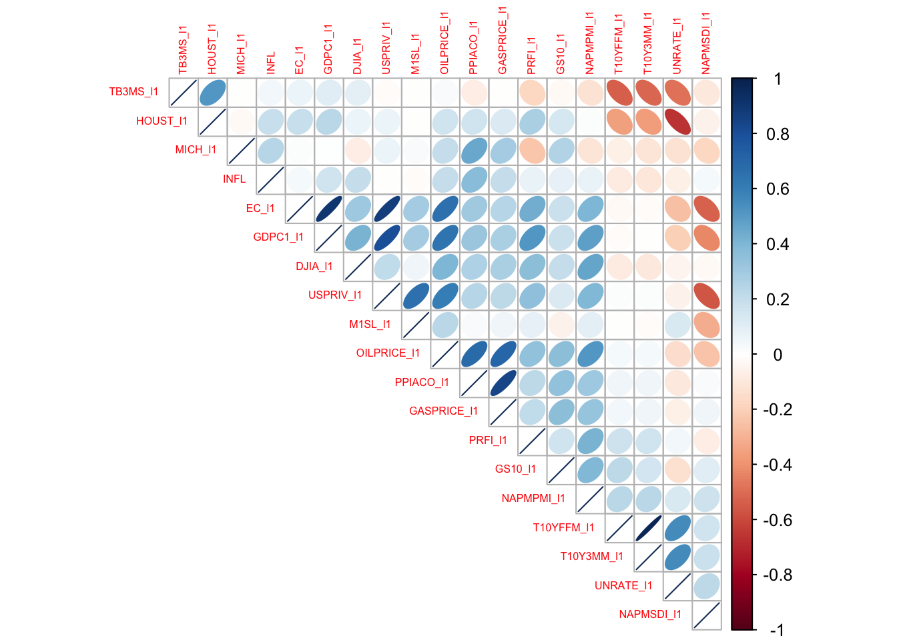
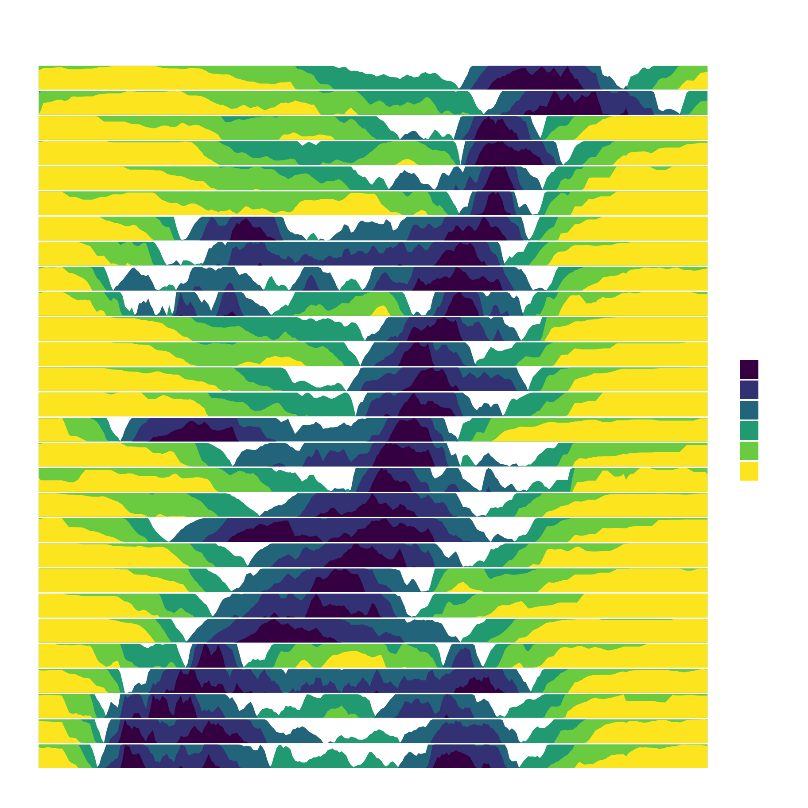

<!-- README.md is generated from README.Rmd. Please edit that file -->

[](http://www.repostatus.org/#active)
[](https://travis-ci.org/hrbrmstr/ggalt)
[](https://ci.appveyor.com/project/hrbrmstr/ggalt)
[](https://CRAN.R-project.org/package=ggalt)


`ggalt` : Extra Coordinate Systems, Geoms, Statistical Transformations,
Scales & Fonts for ‘ggplot2’

A compendium of ‘geoms’, ‘coords’, ‘stats’, scales and fonts for
‘ggplot2’, including splines, 1d and 2d densities, univariate average
shifted histograms, a new map coordinate system based on the
‘PROJ.4’-library and the ‘StateFace’ open source font ‘ProPublica’.

The following functions are implemented:

- `geom_ubar` : Uniform width bar charts

- `geom_horizon` : Horizon charts (modified from
  <https://github.com/AtherEnergy/ggTimeSeries>)

- `coord_proj` : Like `coord_map`, only better (prbly shld use this with
  `geom_cartogram` as `geom_map`’s new defaults are ugh)

- `geom_xspline` : Connect control points/observations with an X-spline

- `stat_xspline` : Connect control points/observations with an X-spline

- `geom_bkde` : Display a smooth density estimate (uses
  `KernSmooth::bkde`)

- `geom_stateface`: Use ProPublica’s StateFace font in ggplot2 plots

- `geom_bkde2d` : Contours from a 2d density estimate. (uses
  `KernSmooth::bkde2D`)

- `stat_bkde` : Display a smooth density estimate (uses
  `KernSmooth::bkde`)

- `stat_bkde2d` : Contours from a 2d density estimate. (uses
  `KernSmooth::bkde2D`)

- `stat_ash` : Compute and display a univariate averaged shifted
  histogram (polynomial kernel) (uses `ash::ash1`/`ash::bin1`)

- `geom_encircle`: Automatically enclose points in a polygon

- `byte_format`: + helpers. e.g. turn `10000` into `10 Kb`

- `geom_lollipop()`: Dead easy lollipops (horizontal or vertical)

- `geom_dumbbell()` : Dead easy dumbbell plots

- `stat_stepribbon()` : Step ribbons

- `annotation_ticks()` : Add minor ticks to identity, exp(1) and exp(10)
  axis scales independently of each other.

- `geom_spikelines()` : Instead of geom_vline and geom_hline a pair of
  segments that originate from same c(x,y) are drawn to the respective
  axes.

- plotly integration for a few of the ^^ geoms

### Installation

``` r
# you'll want to see the vignettes, trust me
install.packages("ggplot2")
install.packages("fdaSP", dependencies = TRUE)
# OR: devtools::install_github("hrbrmstr/ggalt")
```

### Usage

#### Load the Inflation dataset

``` r
load("inflation-Q.RData")

# create the response variable and the design matrix
y                  <- infl.data$CPIAUCSL
X                  <- infl.data[,3:74]
X.std              <- cbind(rep(1, nrow(X)), scale(X))       
y.std              <- scale(y)
colnames(X.std)[1] <- "intercept"

# correlation analysis
data           <- cbind(y.std, X.std[,2:19])
colnames(data) <- c("INFL", colnames(X.std)[2:19])
M              <- cor(data)
corrplot::corrplot(M, order = "AOE", method = "ellipse",
                   type = "upper", tl.cex = 0.5) 
```



``` r
# run lm
formula <- CPIAUCSL ~ UNRATE_l1 + EC_l1 + PRFI_l1 + GDPC1_l1 + HOUST_l1 + USPRIV_l1 + TB3MS_l1 + GS10_l1 + T10Y3MM_l1 +
  T10YFFM_l1 + M1SL_l1 + MICH_l1 + PPIACO_l1 + DJIA_l1 + NAPMPMI_l1 + NAPMSDI_l1 + OILPRICE_l1 + GASPRICE_l1
ret.lm1 <- lm(formula = formula,
                data = infl.data)
summary(ret.lm1)
## 
## Call:
## lm(formula = formula, data = infl.data)
## 
## Residuals:
##       Min        1Q    Median        3Q       Max 
## -0.072883 -0.009561  0.000992  0.009983  0.055086 
## 
## Coefficients:
##               Estimate Std. Error t value Pr(>|t|)   
## (Intercept) -0.1189228  0.0788791  -1.508  0.13462   
## UNRATE_l1    0.2750190  0.1949427   1.411  0.16124   
## EC_l1       -0.3418655  0.4007397  -0.853  0.39554   
## PRFI_l1     -0.0857397  0.0754146  -1.137  0.25814   
## GDPC1_l1     1.4171099  0.4380447   3.235  0.00162 **
## HOUST_l1     0.0167668  0.0098992   1.694  0.09325 . 
## USPRIV_l1   -0.4435282  0.3811955  -1.164  0.24723   
## TB3MS_l1    -0.1152165  0.1411862  -0.816  0.41630   
## GS10_l1     -0.0005272  0.0058215  -0.091  0.92802   
## T10Y3MM_l1  -0.7562681  0.9247730  -0.818  0.41531   
## T10YFFM_l1   0.4674876  0.8931897   0.523  0.60179   
## M1SL_l1      0.0123492  0.0151375   0.816  0.41645   
## MICH_l1      0.2451893  0.4095280   0.599  0.55064   
## PPIACO_l1    0.0029549  0.0009022   3.275  0.00143 **
## DJIA_l1      0.0373644  0.0417599   0.895  0.37295   
## NAPMPMI_l1  -0.0003125  0.0009606  -0.325  0.74562   
## NAPMSDI_l1  -0.0002199  0.0006791  -0.324  0.74675   
## OILPRICE_l1  0.0126106  0.0195869   0.644  0.52108   
## GASPRICE_l1 -0.0302853  0.0135122  -2.241  0.02709 * 
## ---
## Signif. codes:  0 '***' 0.001 '**' 0.01 '*' 0.05 '.' 0.1 ' ' 1
## 
## Residual standard error: 0.02167 on 106 degrees of freedom
## Multiple R-squared:  0.3408, Adjusted R-squared:  0.2288 
## F-statistic: 3.044 on 18 and 106 DF,  p-value: 0.0001889
```

``` r
library(ggplot2)
library(gridExtra)
library(ggalt)
## Registered S3 methods overwritten by 'ggalt':
##   method                  from   
##   grid.draw.absoluteGrob  ggplot2
##   grobHeight.absoluteGrob ggplot2
##   grobWidth.absoluteGrob  ggplot2
##   grobX.absoluteGrob      ggplot2
##   grobY.absoluteGrob      ggplot2
```

``` r

# current verison
packageVersion("ggalt")
## [1] '0.4.0'
```

``` r

set.seed(1492)
dat <- data.frame(x=c(1:10, 1:10, 1:10),
                  y=c(sample(15:30, 10), 2*sample(15:30, 10), 3*sample(15:30, 10)),
                  group=factor(c(rep(1, 10), rep(2, 10), rep(3, 10)))
)
```

### Horzon Chart

Example carved from:
<https://github.com/halhen/viz-pub/blob/master/sports-time-of-day/2_gen_chart.R>

``` r
library(hrbrthemes)
library(ggalt)
library(tidyverse)

sports <- read_tsv("https://github.com/halhen/viz-pub/raw/master/sports-time-of-day/activity.tsv")

sports %>%
  group_by(activity) %>% 
  filter(max(p) > 3e-04, 
         !grepl('n\\.e\\.c', activity)) %>% 
  arrange(time) %>%
  mutate(p_peak = p / max(p), 
         p_smooth = (lag(p_peak) + p_peak + lead(p_peak)) / 3,
         p_smooth = coalesce(p_smooth, p_peak)) %>% 
  ungroup() %>%
  do({ 
    rbind(.,
          filter(., time == 0) %>%
            mutate(time = 24*60))
  }) %>%
  mutate(time = ifelse(time < 3 * 60, time + 24 * 60, time)) %>%
  mutate(activity = reorder(activity, p_peak, FUN=which.max)) %>% 
  arrange(activity) %>%
  mutate(activity.f = reorder(as.character(activity), desc(activity))) -> sports

sports <- mutate(sports, time2 = time/60)

ggplot(sports, aes(time2, p_smooth)) +
  ggHoriPlot::geom_horizon(bandwidth=0.1) +
  facet_grid(activity.f~.) +
  scale_x_continuous(expand=c(0,0), breaks=seq(from = 3, to = 27, by = 3), labels = function(x) {sprintf("%02d:00", as.integer(x %% 24))}) +
  viridis::scale_fill_viridis(name = "Activity relative to peak", discrete=TRUE,
                              labels=scales::percent(seq(0, 1, 0.1)+0.1)) +
  labs(x=NULL, y=NULL, title="Peak time of day for sports and leisure",
       subtitle="Number of participants throughout the day compared to peak popularity.\nNote the morning-and-evening everyday workouts, the midday hobbies,\nand the evenings/late nights out.") +
  theme_ipsum_rc(grid="") +
  theme(panel.spacing.y=unit(-0.05, "lines")) +
  theme(strip.text.y = element_text(hjust=0, angle=360)) +
  theme(axis.text.y=element_blank())
```



### Code of Conduct

Please note that this project is released with a [Contributor Code of
Conduct](CONDUCT.md). By participating in this project you agree to
abide by its terms.
