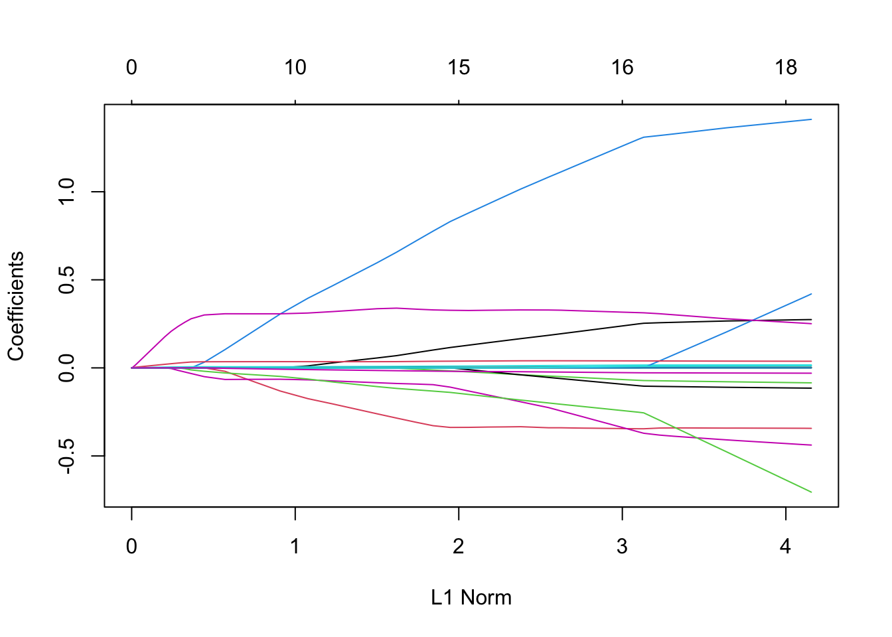
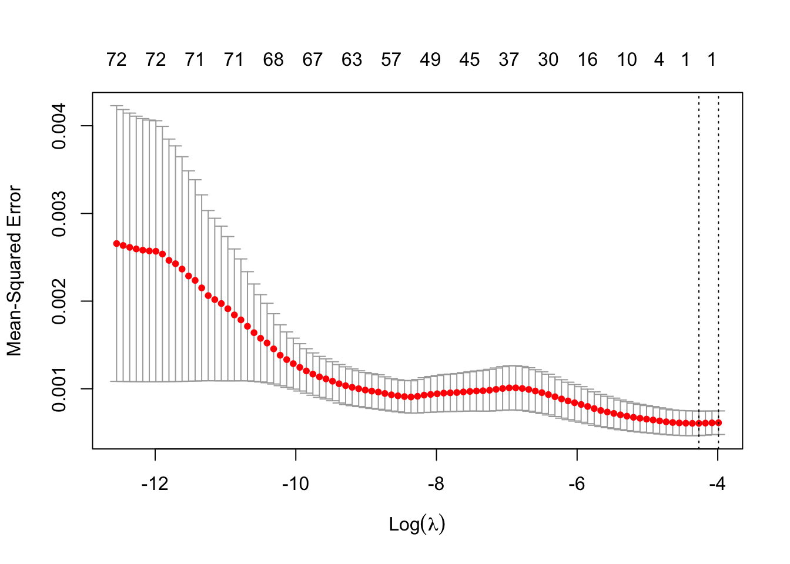

<!-- README.md is generated from README.Rmd. Please edit that file -->

[](http://www.repostatus.org/#active)
[](https://travis-ci.org/hrbrmstr/ggalt)
[](https://ci.appveyor.com/project/hrbrmstr/ggalt)
[](https://CRAN.R-project.org/package=ggalt)


`fdaSP` : sparse functional data analysis

A comprehensive guide to using the ‘fdaSP’ package, covering techniques
such as linear models with lasso, group lasso, sparse group lasso, and
overlapping group lasso penalties.

The following functions are implemented:

- `geom_ubar` : Uniform width bar charts

- `geom_horizon` : Horizon charts (modified from
  <https://github.com/AtherEnergy/ggTimeSeries>)

- `coord_proj` : Like `coord_map`, only better (prbly shld use this with
  `geom_cartogram` as `geom_map`’s new defaults are ugh)

- `geom_xspline` : Connect control points/observations with an X-spline

- `stat_xspline` : Connect control points/observations with an X-spline

- `geom_bkde` : Display a smooth density estimate (uses
  `KernSmooth::bkde`)

- `geom_stateface`: Use ProPublica’s StateFace font in ggplot2 plots

- `geom_bkde2d` : Contours from a 2d density estimate. (uses
  `KernSmooth::bkde2D`)

- `stat_bkde` : Display a smooth density estimate (uses
  `KernSmooth::bkde`)

- `stat_bkde2d` : Contours from a 2d density estimate. (uses
  `KernSmooth::bkde2D`)

- `stat_ash` : Compute and display a univariate averaged shifted
  histogram (polynomial kernel) (uses `ash::ash1`/`ash::bin1`)

- `geom_encircle`: Automatically enclose points in a polygon

- `byte_format`: + helpers. e.g. turn `10000` into `10 Kb`

- `geom_lollipop()`: Dead easy lollipops (horizontal or vertical)

- `geom_dumbbell()` : Dead easy dumbbell plots

- `stat_stepribbon()` : Step ribbons

- `annotation_ticks()` : Add minor ticks to identity, exp(1) and exp(10)
  axis scales independently of each other.

- `geom_spikelines()` : Instead of geom_vline and geom_hline a pair of
  segments that originate from same c(x,y) are drawn to the respective
  axes.

- plotly integration for a few of the ^^ geoms

### Required libraries

``` r
library(glmnet)
## Loading required package: Matrix
## Loaded glmnet 4.1-8
```

### Installation

``` r
# you'll want to see the vignettes, trust me
install.packages("ggplot2")
install.packages("fdaSP", dependencies = TRUE)
# OR: devtools::install_github("hrbrmstr/ggalt")
```

### Usage

#### Load the Inflation dataset

``` r
load("inflation-Q.RData")

# create the response variable and the design matrix
y                  <- infl.data$CPIAUCSL
X                  <- infl.data[,3:74]
X.std              <- cbind(rep(1, nrow(X)), scale(X))       
y.std              <- scale(y)
colnames(X.std)[1] <- "intercept"

# correlation analysis
data           <- cbind(y.std, X.std[,2:19])
colnames(data) <- c("INFL", colnames(X.std)[2:19])
M              <- cor(data)
corrplot::corrplot(M, order = "AOE", method = "ellipse",
                   type = "upper", tl.cex = 0.5) 
```


``` r
# run lm
formula <- CPIAUCSL ~ UNRATE_l1 + EC_l1 + PRFI_l1 + GDPC1_l1 + 
  HOUST_l1 + USPRIV_l1 + TB3MS_l1 + GS10_l1 + T10Y3MM_l1 +
  T10YFFM_l1 + M1SL_l1 + MICH_l1 + PPIACO_l1 + DJIA_l1 + 
  NAPMPMI_l1 + NAPMSDI_l1 + OILPRICE_l1 + GASPRICE_l1
ret.lm1 <- lm(formula = formula,
                data = infl.data)
summary(ret.lm1)
## 
## Call:
## lm(formula = formula, data = infl.data)
## 
## Residuals:
##       Min        1Q    Median        3Q       Max 
## -0.072883 -0.009561  0.000992  0.009983  0.055086 
## 
## Coefficients:
##               Estimate Std. Error t value Pr(>|t|)   
## (Intercept) -0.1189228  0.0788791  -1.508  0.13462   
## UNRATE_l1    0.2750190  0.1949427   1.411  0.16124   
## EC_l1       -0.3418655  0.4007397  -0.853  0.39554   
## PRFI_l1     -0.0857397  0.0754146  -1.137  0.25814   
## GDPC1_l1     1.4171099  0.4380447   3.235  0.00162 **
## HOUST_l1     0.0167668  0.0098992   1.694  0.09325 . 
## USPRIV_l1   -0.4435282  0.3811955  -1.164  0.24723   
## TB3MS_l1    -0.1152165  0.1411862  -0.816  0.41630   
## GS10_l1     -0.0005272  0.0058215  -0.091  0.92802   
## T10Y3MM_l1  -0.7562681  0.9247730  -0.818  0.41531   
## T10YFFM_l1   0.4674876  0.8931897   0.523  0.60179   
## M1SL_l1      0.0123492  0.0151375   0.816  0.41645   
## MICH_l1      0.2451893  0.4095280   0.599  0.55064   
## PPIACO_l1    0.0029549  0.0009022   3.275  0.00143 **
## DJIA_l1      0.0373644  0.0417599   0.895  0.37295   
## NAPMPMI_l1  -0.0003125  0.0009606  -0.325  0.74562   
## NAPMSDI_l1  -0.0002199  0.0006791  -0.324  0.74675   
## OILPRICE_l1  0.0126106  0.0195869   0.644  0.52108   
## GASPRICE_l1 -0.0302853  0.0135122  -2.241  0.02709 * 
## ---
## Signif. codes:  0 '***' 0.001 '**' 0.01 '*' 0.05 '.' 0.1 ' ' 1
## 
## Residual standard error: 0.02167 on 106 degrees of freedom
## Multiple R-squared:  0.3408, Adjusted R-squared:  0.2288 
## F-statistic: 3.044 on 18 and 106 DF,  p-value: 0.0001889
```

``` r
# Fit whole solution path for illustration
fit <- glmnet(x = as.matrix(X), y = y, standardize = TRUE, nlambda = 100)
plot(fit)
```



``` r

# Perform tenfold cross-validation
set.seed(42)
fit.cv <- cv.glmnet(x = as.matrix(X), y = y, standardize = TRUE, nlambda = 100, alpha = 0.5)

# fit with best lambda
fit <- glmnet(x = as.matrix(X), y = y, standardize = TRUE, lambda = fit.cv$lambda.min)
b   <- as.matrix(coef(fit))
b
##                     s0
## (Intercept) 0.02544468
## UNRATE_l1   0.00000000
## EC_l1       0.00000000
## PRFI_l1     0.00000000
## GDPC1_l1    0.00000000
## HOUST_l1    0.00000000
## USPRIV_l1   0.00000000
## TB3MS_l1    0.00000000
## GS10_l1     0.00000000
## T10Y3MM_l1  0.00000000
## T10YFFM_l1  0.00000000
## M1SL_l1     0.00000000
## MICH_l1     0.00000000
## PPIACO_l1   0.00000000
## DJIA_l1     0.00000000
## NAPMPMI_l1  0.00000000
## NAPMSDI_l1  0.00000000
## OILPRICE_l1 0.00000000
## GASPRICE_l1 0.00000000
## UNRATE_l2   0.00000000
## EC_l2       0.00000000
## PRFI_l2     0.00000000
## GDPC1_l2    0.00000000
## HOUST_l2    0.00000000
## USPRIV_l2   0.00000000
## TB3MS_l2    0.00000000
## GS10_l2     0.00000000
## T10Y3MM_l2  0.00000000
## T10YFFM_l2  0.00000000
## M1SL_l2     0.00000000
## MICH_l2     0.00000000
## PPIACO_l2   0.00000000
## DJIA_l2     0.00000000
## NAPMPMI_l2  0.00000000
## NAPMSDI_l2  0.00000000
## OILPRICE_l2 0.00000000
## GASPRICE_l2 0.00000000
## UNRATE_l3   0.00000000
## EC_l3       0.00000000
## PRFI_l3     0.00000000
## GDPC1_l3    0.00000000
## HOUST_l3    0.00000000
## USPRIV_l3   0.00000000
## TB3MS_l3    0.00000000
## GS10_l3     0.00000000
## T10Y3MM_l3  0.00000000
## T10YFFM_l3  0.00000000
## M1SL_l3     0.00000000
## MICH_l3     0.00000000
## PPIACO_l3   0.00000000
## DJIA_l3     0.00000000
## NAPMPMI_l3  0.00000000
## NAPMSDI_l3  0.00000000
## OILPRICE_l3 0.00000000
## GASPRICE_l3 0.00000000
## UNRATE_l4   0.00000000
## EC_l4       0.00000000
## PRFI_l4     0.00000000
## GDPC1_l4    0.00000000
## HOUST_l4    0.00000000
## USPRIV_l4   0.00000000
## TB3MS_l4    0.00000000
## GS10_l4     0.00000000
## T10Y3MM_l4  0.00000000
## T10YFFM_l4  0.00000000
## M1SL_l4     0.00000000
## MICH_l4     0.00000000
## PPIACO_l4   0.00000000
## DJIA_l4     0.00000000
## NAPMPMI_l4  0.00000000
## NAPMSDI_l4  0.00000000
## OILPRICE_l4 0.00000000
## GASPRICE_l4 0.00000000
```

``` r

# Visualize cross-validation error-path
plot(fit.cv)
```



``` r

# Get selected variables
b <- as.matrix(coef(fit.cv))
rownames(b)[b != 0]
## [1] "(Intercept)"
```

``` r
## By default, the selected variables are based on the largest value of
## lambda such that the cv-error is within 1 standard error of the minimum
```
