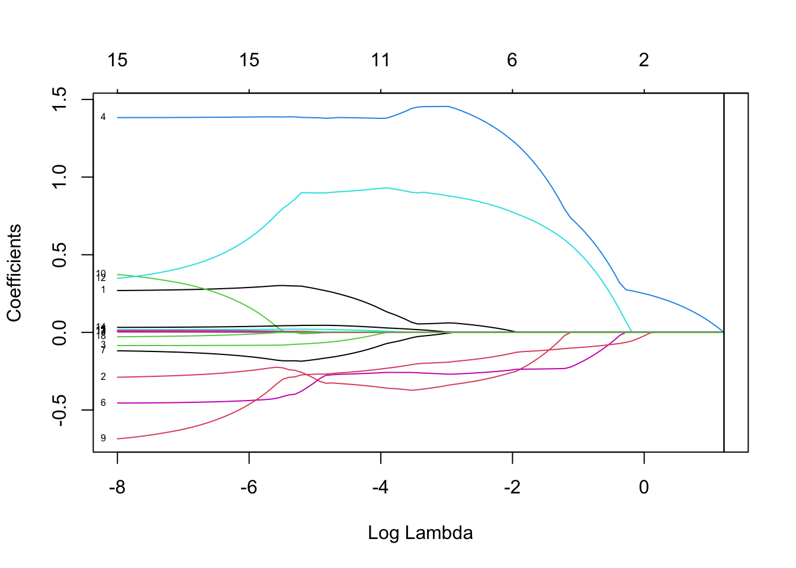

fdaSP: An R Package for sparse functional data analysis
================
11 November 2024

<!-- README.md is generated from README.Rmd. Please edit that file -->

[](http://www.repostatus.org/#active)
[](https://travis-ci.org/hrbrmstr/ggalt)
[](https://ci.appveyor.com/project/hrbrmstr/ggalt)
[](https://CRAN.R-project.org/package=ggalt)


`fdaSP` : sparse functional data analysis

A comprehensive guide to using the ‘fdaSP’ package, covering techniques
such as linear models with lasso, group lasso, sparse group lasso, and
overlapping group lasso penalties, see (Mauro Bernardi and Stefanucci
2023).

The following functions are implemented:

- `lmSP` : Sparse Adaptive Overlap Group Least Absolute Shrinkage and
  Selection Operator
- `lmSP_cv` : Cross-validation for Sparse Adaptive Overlap Group Least
  Absolute Shrinkage and Selection Operator
- `f2sSP` : Overlap Group Least Absolute Shrinkage and Selection
  Operator for scalar-on-function regression model
- `f2sSP_cv` : Cross-validation for Overlap Group Least Absolute
  Shrinkage and Selection Operator on scalar-on-function regression
  model
- `f2fSP` : Overlap Group Least Absolute Shrinkage and Selection
  Operator for function-on-function regression model
- `f2fSP_cv` : Cross-validation for Overlap Group Least Absolute
  Shrinkage and Selection Operator on scalar-on-function regression
  model

### Required libraries

``` r
library(glmnet)
## Loading required package: Matrix
## Loaded glmnet 4.1-8
```

``` r
library(leaps)
library(BMS)
```

### Installation

``` r
# you'll want to see the vignettes, trust me
install.packages("ggplot2")
install.packages("fdaSP", dependencies = TRUE)
# OR: devtools::install_github("hrbrmstr/ggalt")
```

### Inflation dataset

#### Load the Inflation dataset

Load the Inflation dataset. We consider the quarterly changes in the
Consumer Price Index (CPIAUCSL,CPILFESL) as a measure of inflation.
Inflation is predicted using quarterly data from several macroeconomic
indicators, see (Bernardi et al. 2024). In this example, we consider
quarterly observations for the period from 1991-Q3 to 2023-Q4. Further
details on the variables used and their sources can be found in the data
appendix of (Bernardi et al. 2024).

``` r
load("inflation-Q.RData")

# create the response variable and the design matrix
y                  <- infl.data$CPIAUCSL
X                  <- infl.data[,3:74]
X.std              <- cbind(rep(1, nrow(X)), scale(X))       
y.std              <- scale(y)
colnames(X.std)[1] <- "intercept"
```

#### Preliminary analysis

``` r
# correlation analysis
data           <- cbind(y.std, X.std[,2:19])
colnames(data) <- c("INFL", colnames(X.std)[2:19])
M              <- cor(data)
corrplot::corrplot(M, order = "AOE", method = "ellipse",
                   type = "upper", tl.cex = 0.5) 
```


``` r
# run lm
formula <- CPIAUCSL ~ UNRATE_l1 + EC_l1 + PRFI_l1 + GDPC1_l1 + 
  HOUST_l1 + USPRIV_l1 + TB3MS_l1 + GS10_l1 + T10Y3MM_l1 +
  T10YFFM_l1 + M1SL_l1 + MICH_l1 + PPIACO_l1 + DJIA_l1 + 
  NAPMPMI_l1 + NAPMSDI_l1 + OILPRICE_l1 + GASPRICE_l1
ret.lm1 <- lm(formula = formula,
                data = infl.data)
summary(ret.lm1)
## 
## Call:
## lm(formula = formula, data = infl.data)
## 
## Residuals:
##       Min        1Q    Median        3Q       Max 
## -0.072883 -0.009561  0.000992  0.009983  0.055086 
## 
## Coefficients:
##               Estimate Std. Error t value Pr(>|t|)   
## (Intercept) -0.1189228  0.0788791  -1.508  0.13462   
## UNRATE_l1    0.2750190  0.1949427   1.411  0.16124   
## EC_l1       -0.3418655  0.4007397  -0.853  0.39554   
## PRFI_l1     -0.0857397  0.0754146  -1.137  0.25814   
## GDPC1_l1     1.4171099  0.4380447   3.235  0.00162 **
## HOUST_l1     0.0167668  0.0098992   1.694  0.09325 . 
## USPRIV_l1   -0.4435282  0.3811955  -1.164  0.24723   
## TB3MS_l1    -0.1152165  0.1411862  -0.816  0.41630   
## GS10_l1     -0.0005272  0.0058215  -0.091  0.92802   
## T10Y3MM_l1  -0.7562681  0.9247730  -0.818  0.41531   
## T10YFFM_l1   0.4674876  0.8931897   0.523  0.60179   
## M1SL_l1      0.0123492  0.0151375   0.816  0.41645   
## MICH_l1      0.2451893  0.4095280   0.599  0.55064   
## PPIACO_l1    0.0029549  0.0009022   3.275  0.00143 **
## DJIA_l1      0.0373644  0.0417599   0.895  0.37295   
## NAPMPMI_l1  -0.0003125  0.0009606  -0.325  0.74562   
## NAPMSDI_l1  -0.0002199  0.0006791  -0.324  0.74675   
## OILPRICE_l1  0.0126106  0.0195869   0.644  0.52108   
## GASPRICE_l1 -0.0302853  0.0135122  -2.241  0.02709 * 
## ---
## Signif. codes:  0 '***' 0.001 '**' 0.01 '*' 0.05 '.' 0.1 ' ' 1
## 
## Residual standard error: 0.02167 on 106 degrees of freedom
## Multiple R-squared:  0.3408, Adjusted R-squared:  0.2288 
## F-statistic: 3.044 on 18 and 106 DF,  p-value: 0.0001889
```

``` r
# Fit whole solution path for illustration
fit <- glmnet(x = as.matrix(X)[,1:18], y = y, standardize = TRUE, nlambda = 100)
plot(fit)
```


``` r

# Perform tenfold cross-validation
set.seed(42)
fit.cv <- cv.glmnet(x = as.matrix(X)[,1:18], y = y, standardize = TRUE, 
                    nlambda = 100, alpha = 0.5)

# fit with best lambda
fit <- glmnet(x = as.matrix(X), y = y, standardize = TRUE, 
              lambda = fit.cv$lambda.min)
b   <- as.matrix(coef(fit))

# Visualize cross-validation error-path
plot(fit.cv)
```


``` r

# Get selected variables
b <- as.matrix(coef(fit.cv))
rownames(b)[b != 0]
## [1] "(Intercept)"
```

``` r
## By default, the selected variables are based on the largest value of
## lambda such that the cv-error is within 1 standard error of the minimum
```

``` r
# best subset
lm.subset <- regsubsets(x = X.std[,2:19], y = y.std, 
                        method = "exhaustive", nvmax = 8)
summary(lm.subset)
## Subset selection object
## 18 Variables  (and intercept)
##             Forced in Forced out
## UNRATE_l1       FALSE      FALSE
## EC_l1           FALSE      FALSE
## PRFI_l1         FALSE      FALSE
## GDPC1_l1        FALSE      FALSE
## HOUST_l1        FALSE      FALSE
## USPRIV_l1       FALSE      FALSE
## TB3MS_l1        FALSE      FALSE
## GS10_l1         FALSE      FALSE
## T10Y3MM_l1      FALSE      FALSE
## T10YFFM_l1      FALSE      FALSE
## M1SL_l1         FALSE      FALSE
## MICH_l1         FALSE      FALSE
## PPIACO_l1       FALSE      FALSE
## DJIA_l1         FALSE      FALSE
## NAPMPMI_l1      FALSE      FALSE
## NAPMSDI_l1      FALSE      FALSE
## OILPRICE_l1     FALSE      FALSE
## GASPRICE_l1     FALSE      FALSE
## 1 subsets of each size up to 8
## Selection Algorithm: exhaustive
##          UNRATE_l1 EC_l1 PRFI_l1 GDPC1_l1 HOUST_l1 USPRIV_l1 TB3MS_l1 GS10_l1 T10Y3MM_l1 T10YFFM_l1 M1SL_l1 MICH_l1
## 1  ( 1 ) " "       " "   " "     " "      " "      " "       " "      " "     " "        " "        " "     " "    
## 2  ( 1 ) " "       " "   " "     " "      " "      " "       " "      " "     " "        " "        " "     " "    
## 3  ( 1 ) " "       "*"   " "     "*"      " "      " "       " "      " "     " "        " "        " "     " "    
## 4  ( 1 ) " "       "*"   " "     "*"      " "      " "       " "      " "     " "        " "        " "     " "    
## 5  ( 1 ) " "       "*"   " "     "*"      " "      " "       " "      " "     "*"        " "        " "     " "    
## 6  ( 1 ) " "       "*"   " "     "*"      "*"      " "       " "      " "     "*"        " "        " "     " "    
## 7  ( 1 ) " "       "*"   "*"     "*"      "*"      " "       " "      " "     " "        " "        " "     " "    
## 8  ( 1 ) " "       "*"   "*"     "*"      "*"      " "       " "      " "     " "        " "        " "     " "    
##          PPIACO_l1 DJIA_l1 NAPMPMI_l1 NAPMSDI_l1 OILPRICE_l1 GASPRICE_l1
## 1  ( 1 ) "*"       " "     " "        " "        " "         " "        
## 2  ( 1 ) "*"       " "     " "        " "        " "         "*"        
## 3  ( 1 ) "*"       " "     " "        " "        " "         " "        
## 4  ( 1 ) "*"       " "     " "        " "        " "         "*"        
## 5  ( 1 ) "*"       " "     " "        " "        " "         "*"        
## 6  ( 1 ) "*"       " "     " "        " "        " "         "*"        
## 7  ( 1 ) "*"       "*"     " "        " "        " "         "*"        
## 8  ( 1 ) "*"       "*"     "*"        " "        " "         "*"
```

``` r
bic <- summary(lm.subset)$bic
rss <- summary(lm.subset)$rss
cp  <- summary(lm.subset)$cp

# define the optimal model using BIC and run LM
idx <- which(summary(lm.subset)$which[which.min(bic),] == TRUE)
coef(lm(y.std ~ X.std[,idx]-1))
##   X.std[, idx]intercept       X.std[, idx]EC_l1    X.std[, idx]GDPC1_l1   X.std[, idx]PPIACO_l1 X.std[, idx]GASPRICE_l1 
##            3.786142e-16           -6.958761e-01            6.777184e-01            7.424334e-01           -4.390489e-01
```

``` r

# plot
plot(1:8, bic, col = "red", ylim = c(-17, 15), type = "l", lwd = 1.2)
lines(1:8, cp, col = "blue",  lwd = 1.2)
```


``` r
## Ridge Regression to create the adaptive weights 
set.seed(1234)
cv.ridge <- cv.glmnet(x = as.matrix(X)[,1:18], y = y, family = "gaussian", 
                      alpha = 0, parallel = FALSE, standardize = TRUE)
cv.ridge
## 
## Call:  cv.glmnet(x = as.matrix(X)[, 1:18], y = y, parallel = FALSE,      family = "gaussian", alpha = 0, standardize = TRUE) 
## 
## Measure: Mean-Squared Error 
## 
##     Lambda Index   Measure        SE Nonzero
## min  0.170    44 0.0006057 0.0001089      18
## 1se  9.259     1 0.0006167 0.0001174      18
```

``` r
coef(cv.ridge)
## 19 x 1 sparse Matrix of class "dgCMatrix"
##                        s1
## (Intercept)  2.544468e-02
## UNRATE_l1   -9.076775e-38
## EC_l1        4.020870e-38
## PRFI_l1      4.544368e-38
## GDPC1_l1     3.596788e-37
## HOUST_l1     1.410964e-38
## USPRIV_l1   -8.213329e-39
## TB3MS_l1     5.824287e-38
## GS10_l1      4.941943e-39
## T10Y3MM_l1  -2.208209e-37
## T10YFFM_l1  -1.703485e-37
## M1SL_l1     -1.128147e-39
## MICH_l1      8.802195e-37
## PPIACO_l1    1.872022e-39
## DJIA_l1      8.172562e-38
## NAPMPMI_l1   5.184328e-40
## NAPMSDI_l1   1.855601e-40
## OILPRICE_l1  2.365611e-38
## GASPRICE_l1  1.610257e-38
```

``` r
ridge.wei <- 1.0 / abs(matrix(coef(cv.ridge, s = cv.ridge$lambda.min)))[-1]
lm.wei    <- 1.0 / abs(matrix(coef(ret.lm1)))[-1]

## Adaptive Lasso
cv.lasso <- cv.glmnet(x = as.matrix(X)[,1:18], y = y, family = "gaussian", alpha = 1, 
                      parallel = FALSE, standardize = TRUE, type.measure = "mse", 
                      penalty.factor = lm.wei)
plot(cv.lasso)
```


``` r
plot(cv.lasso$glmnet.fit, xvar = "lambda", label = TRUE)
abline(v = log(cv.lasso$lambda.min))
abline(v = log(cv.lasso$lambda.1se))
```



``` r
coef(cv.lasso, s = cv.lasso$lambda.1se)
## 19 x 1 sparse Matrix of class "dgCMatrix"
##                     s1
## (Intercept) 0.02544468
## UNRATE_l1   .         
## EC_l1       .         
## PRFI_l1     .         
## GDPC1_l1    .         
## HOUST_l1    .         
## USPRIV_l1   .         
## TB3MS_l1    .         
## GS10_l1     .         
## T10Y3MM_l1  .         
## T10YFFM_l1  .         
## M1SL_l1     .         
## MICH_l1     .         
## PPIACO_l1   .         
## DJIA_l1     .         
## NAPMPMI_l1  .         
## NAPMSDI_l1  .         
## OILPRICE_l1 .         
## GASPRICE_l1 .
```

``` r
coef <- coef(cv.lasso, s = "lambda.1se")
```

``` r
# BMS
# estimating a standard MC3 chain and uniform model priors
X.data <- cbind(y, X[,1:18])
bma1   <- bms(X.data = X.data, burn = 10000, iter = 50000, mprior = "uniform", 
              mcmc = "rev.jump", nmodel = 10, logfile = FALSE)
##                 PIP     Post Mean      Post SD Cond.Pos.Sign Idx
## PPIACO_l1   0.99812  3.279987e-03 0.0009475567    1.00000000  13
## GDPC1_l1    0.87686  1.185458e+00 0.5893093366    0.99938417   4
## GASPRICE_l1 0.84888 -2.815847e-02 0.0159408575    0.00023560  18
## EC_l1       0.77716 -5.706071e-01 0.3703908277    0.00090072   2
## USPRIV_l1   0.20738 -8.267145e-02 0.2153552317    0.00125374   6
## T10Y3MM_l1  0.19590 -6.955987e-02 0.2366921500    0.00000000   9
## HOUST_l1    0.18452  1.534015e-03 0.0042450081    1.00000000   5
## M1SL_l1     0.16672  2.438334e-03 0.0082296476    0.80170345  11
## T10YFFM_l1  0.16212 -6.320770e-03 0.1982868250    0.17283494  10
## DJIA_l1     0.13524  5.409657e-03 0.0190898786    1.00000000  14
## MICH_l1     0.11894  3.415568e-02 0.1528200134    0.99983185  12
## NAPMSDI_l1  0.10510 -2.084314e-05 0.0001892722    0.12540438  16
## OILPRICE_l1 0.10064  8.587745e-04 0.0068052338    0.82988871  17
## UNRATE_l1   0.09924 -3.909829e-04 0.0485124863    0.46453043   1
## NAPMPMI_l1  0.09882 -4.431392e-05 0.0002625898    0.03703704  15
## TB3MS_l1    0.09574  5.148381e-03 0.0387493201    0.89137247   7
## GS10_l1     0.09318 -4.539528e-05 0.0014820638    0.29555699   8
## PRFI_l1     0.09020 -2.794715e-03 0.0204076767    0.05498891   3
## 
## Mean no. regressors               Draws             Burnins                Time  No. models visited      Modelspace 2^K 
##            "5.3548"             "50000"             "10000"     "1.147024 secs"             "14130"            "262144" 
##           % visited         % Topmodels            Corr PMP            No. Obs.         Model Prior             g-Prior 
##               "5.4"                "28"            "0.9940"               "125"       "uniform / 9"               "UIP" 
##     Shrinkage-Stats 
##         "Av=0.9921" 
## 
## Time difference of 1.147024 secs
```


``` r
bma2   <- bms(X.data = X.data, burn = 10000, iter = 50000, mprior = "uniform", 
              mcmc = "enumerate", nmodel = 10)
##                    PIP     Post Mean      Post SD Cond.Pos.Sign Idx
## PPIACO_l1   0.99086376  2.889721e-03 0.0010241260    1.00000000  13
## GASPRICE_l1 0.70700947 -2.121503e-02 0.0168383404    0.00171363  18
## USPRIV_l1   0.61003651 -3.250606e-01 0.3323101743    0.00000758   6
## GDPC1_l1    0.57738529  5.788906e-01 0.5985745401    0.99760260   4
## M1SL_l1     0.42717096  9.879087e-03 0.0139043818    0.92948584  11
## T10Y3MM_l1  0.17544649 -6.146425e-02 0.2374899323    0.00037620   9
## DJIA_l1     0.17456811  8.030816e-03 0.0235011148    1.00000000  14
## HOUST_l1    0.16588527  1.264008e-03 0.0038896222    1.00000000   5
## MICH_l1     0.15258768  6.200737e-02 0.2051896177    0.99995982  12
## T10YFFM_l1  0.13634137  3.030861e-03 0.1999412155    0.18558361  10
## OILPRICE_l1 0.10059907 -1.267061e-04 0.0063369850    0.45059115  17
## NAPMSDI_l1  0.09990701 -1.037653e-05 0.0001949098    0.39492112  16
## TB3MS_l1    0.09930399  4.313402e-03 0.0402093655    0.78868614   7
## NAPMPMI_l1  0.09143508 -2.147806e-05 0.0002319726    0.19280383  15
## GS10_l1     0.08659611 -1.100523e-04 0.0015038919    0.15389651   8
## PRFI_l1     0.06186678 -2.052654e-03 0.0170024353    0.01177199   3
## UNRATE_l1   0.00000000  0.000000e+00 0.0000000000            NA   1
## EC_l1       0.00000000  0.000000e+00 0.0000000000            NA   2
## 
## Mean no. regressors               Draws             Burnins                Time  No. models visited      Modelspace 2^K 
##            "4.6570"             "50001"                 "0"    "0.8201439 secs"             "50001"            "262144" 
##           % visited         % Topmodels            Corr PMP            No. Obs.         Model Prior             g-Prior 
##                "19"              "0.02"                "NA"               "125"       "uniform / 9"               "UIP" 
##     Shrinkage-Stats 
##         "Av=0.9921" 
## 
## Time difference of 0.8201439 secs
```


``` r

# summary
summary(bma1)
## Mean no. regressors               Draws             Burnins                Time  No. models visited      Modelspace 2^K 
##            "5.3548"             "50000"             "10000"     "1.147024 secs"             "14130"            "262144" 
##           % visited         % Topmodels            Corr PMP            No. Obs.         Model Prior             g-Prior 
##               "5.4"                "28"            "0.9940"               "125"       "uniform / 9"               "UIP" 
##     Shrinkage-Stats 
##         "Av=0.9921"
```

``` r

# standard coefficients based on exact likelihoods of the 100 best models:
coef(bma1, exact = TRUE, std.coefs = FALSE, order.by.pip = FALSE, include.constant = TRUE) 
##                    PIP     Post Mean     Post SD Cond.Pos.Sign Idx
## UNRATE_l1   0.04826486 -4.395693e-03 0.030160282             0   1
## EC_l1       0.95273355 -7.265324e-01 0.251228868             0   2
## PRFI_l1     0.00000000  0.000000e+00 0.000000000            NA   3
## GDPC1_l1    1.00000000  1.396489e+00 0.380574576             1   4
## HOUST_l1    0.10034628  8.282935e-04 0.003039334             1   5
## USPRIV_l1   0.04726645 -3.235324e-02 0.149988491             0   6
## TB3MS_l1    0.05287083  4.845864e-03 0.029903405             1   7
## GS10_l1     0.00000000  0.000000e+00 0.000000000            NA   8
## T10Y3MM_l1  0.13732818 -3.637398e-02 0.108154497             0   9
## T10YFFM_l1  0.09713127 -2.119484e-02 0.079542002             0  10
## M1SL_l1     0.04726645  1.229035e-03 0.005903027             1  11
## MICH_l1     0.00000000  0.000000e+00 0.000000000            NA  12
## PPIACO_l1   1.00000000  3.537286e-03 0.000795067             1  13
## DJIA_l1     0.05618174  1.935240e-03 0.011220471             1  14
## NAPMPMI_l1  0.04741136 -2.607261e-05 0.000183077             0  15
## NAPMSDI_l1  0.00000000  0.000000e+00 0.000000000            NA  16
## OILPRICE_l1 0.00000000  0.000000e+00 0.000000000            NA  17
## GASPRICE_l1 0.95593988 -3.220209e-02 0.012896001             0  18
## (Intercept) 1.00000000  1.349721e-02          NA            NA   0
```

``` r

# best models
bma1$topmod
##       Marg.Log.Lik MCMC Freq
## 14021     170.5815      5280
## 14221     169.5927      1670
## 16021     169.2789      1260
## 14121     169.2464      1405
## 14031     168.6989       729
## 14821     168.6382       723
## 34021     168.5470       673
## 14029     168.5292       562
## 050a1     168.5261       986
## 14020     168.4559       537
```

``` r
bma2$topmod
##       Marg.Log.Lik MCMC Freq
## 050a1     168.5261         1
## 00021     167.9571         1
## 05021     167.3577         1
## 050a0     167.1748         1
## 00020     167.1535         1
## 052a1     167.0107         1
## 050e1     166.8996         1
## 00031     166.8808         1
## 02021     166.8457         1
## 00221     166.7146         1
```

``` r

#show binaries for 1st, 2nd and 3rd best model, without the model probs
topmodels.bma(bma1[1:8])
##                  14021      14221     16021      14121      14031      14821     34021      14029
## UNRATE_l1   0.00000000 0.00000000 0.0000000 0.00000000 0.00000000 0.00000000 1.0000000 0.00000000
## EC_l1       1.00000000 1.00000000 1.0000000 1.00000000 1.00000000 1.00000000 1.0000000 1.00000000
## PRFI_l1     0.00000000 0.00000000 0.0000000 0.00000000 0.00000000 0.00000000 0.0000000 0.00000000
## GDPC1_l1    1.00000000 1.00000000 1.0000000 1.00000000 1.00000000 1.00000000 1.0000000 1.00000000
## HOUST_l1    0.00000000 0.00000000 1.0000000 0.00000000 0.00000000 0.00000000 0.0000000 0.00000000
## USPRIV_l1   0.00000000 0.00000000 0.0000000 0.00000000 0.00000000 0.00000000 0.0000000 0.00000000
## TB3MS_l1    0.00000000 0.00000000 0.0000000 0.00000000 0.00000000 1.00000000 0.0000000 0.00000000
## GS10_l1     0.00000000 0.00000000 0.0000000 0.00000000 0.00000000 0.00000000 0.0000000 0.00000000
## T10Y3MM_l1  0.00000000 1.00000000 0.0000000 0.00000000 0.00000000 0.00000000 0.0000000 0.00000000
## T10YFFM_l1  0.00000000 0.00000000 0.0000000 1.00000000 0.00000000 0.00000000 0.0000000 0.00000000
## M1SL_l1     0.00000000 0.00000000 0.0000000 0.00000000 0.00000000 0.00000000 0.0000000 0.00000000
## MICH_l1     0.00000000 0.00000000 0.0000000 0.00000000 0.00000000 0.00000000 0.0000000 0.00000000
## PPIACO_l1   1.00000000 1.00000000 1.0000000 1.00000000 1.00000000 1.00000000 1.0000000 1.00000000
## DJIA_l1     0.00000000 0.00000000 0.0000000 0.00000000 1.00000000 0.00000000 0.0000000 0.00000000
## NAPMPMI_l1  0.00000000 0.00000000 0.0000000 0.00000000 0.00000000 0.00000000 0.0000000 1.00000000
## NAPMSDI_l1  0.00000000 0.00000000 0.0000000 0.00000000 0.00000000 0.00000000 0.0000000 0.00000000
## OILPRICE_l1 0.00000000 0.00000000 0.0000000 0.00000000 0.00000000 0.00000000 0.0000000 0.00000000
## GASPRICE_l1 1.00000000 1.00000000 1.0000000 1.00000000 1.00000000 1.00000000 1.0000000 1.00000000
## PMP (Exact) 0.09995114 0.03718412 0.0271706 0.02630007 0.01521224 0.01431575 0.0130686 0.01283749
## PMP (MCMC)  0.10560000 0.03340000 0.0252000 0.02810000 0.01458000 0.01446000 0.0134600 0.01124000
```

``` r

#topbest1 <- topmodels.bma(bma1[1])[1:(dim(X)[2])]
#which(topmodels.bma(bma1[1, 1:2]) == 1.0)
#beta.draws.bma(bma1)[,1]
```

``` r
# linear regression with lagged endogenous variables (LAG 1 to 4)
load("inflation-Q.RData")
head(infl.data)
##      DATE   CPIAUCSL UNRATE_l1       EC_l1     PRFI_l1    GDPC1_l1 HOUST_l1    USPRIV_l1 TB3MS_l1 GS10_l1 T10Y3MM_l1
## 1 1991-07 0.03181258     0.074 0.003783491 0.043585274 0.010784669 7.002156  0.002073080   0.0375    0.45     0.0364
## 2 1991-10 0.03445507     0.077 0.011185031 0.007688834 0.009832603 7.037906  0.001212964   0.0321   -0.64     0.0356
## 3 1992-01 0.03129225     0.073 0.012331301 0.050514709 0.010374554 7.126087  0.001317234   0.0286   -0.25     0.0366
## 4 1992-04 0.02820713     0.073 0.006838106 0.011376139 0.001668045 7.098376  0.002877143   0.0300    0.01     0.0353
## 5 1992-07 0.01956620     0.071 0.005852219 0.024041667 0.005804829 7.137278 -0.001384073   0.0287   -0.63     0.0304
## 6 1992-10 0.03068133     0.069 0.012009059 0.045474524 0.004760200 7.134094  0.001933419   0.0304   -0.16     0.0270
##   T10YFFM_l1       M1SL_l1 MICH_l1 PPIACO_l1     DJIA_l1 NAPMPMI_l1 NAPMSDI_l1  OILPRICE_l1 GASPRICE_l1 UNRATE_l2
## 1     0.0375 -0.0002148796   0.030       0.7  0.04124543        5.3       -1.3  0.072888921       0.030     0.073
## 2     0.0359 -0.0160260134   0.027       1.6  0.01026531        1.3        5.1  0.072218410       0.085     0.074
## 3     0.0349  0.0212780104   0.028       0.2 -0.05061457       -3.6       -3.9 -0.003268353      -0.023     0.077
## 4     0.0358 -0.0153375933   0.029      -0.1  0.02562748        5.5        3.7 -0.128380535      -0.052     0.073
## 5     0.0301 -0.0099090276   0.030       1.3  0.03488847       -5.6        0.5  0.060763383       0.016     0.073
## 6     0.0275  0.0186262774   0.030      -0.1  0.03213128        0.0       -1.8 -0.126242495       0.000     0.071
##         EC_l2     PRFI_l2    GDPC1_l2 HOUST_l2    USPRIV_l2 TB3MS_l2 GS10_l2 T10Y3MM_l2 T10YFFM_l2       M1SL_l2
## 1 0.020902523 0.052114065 0.011901418 7.069874 -0.001838789   0.0380   -0.50     0.0312     0.0300  0.0178676954
## 2 0.003783491 0.043585274 0.010784669 7.002156  0.002073080   0.0375    0.45     0.0364     0.0375 -0.0002148796
## 3 0.011185031 0.007688834 0.009832603 7.037906  0.001212964   0.0321   -0.64     0.0356     0.0359 -0.0160260134
## 4 0.012331301 0.050514709 0.010374554 7.126087  0.001317234   0.0286   -0.25     0.0366     0.0349  0.0212780104
## 5 0.006838106 0.011376139 0.001668045 7.098376  0.002877143   0.0300    0.01     0.0353     0.0358 -0.0153375933
## 6 0.005852219 0.024041667 0.005804829 7.137278 -0.001384073   0.0287   -0.63     0.0304     0.0301 -0.0099090276
##   MICH_l2 PPIACO_l2     DJIA_l2 NAPMPMI_l2 NAPMSDI_l2  OILPRICE_l2 GASPRICE_l2 UNRATE_l3        EC_l3     PRFI_l3
## 1   0.027      -0.8  0.04904924       -5.8       -1.5 -0.210438313      -0.066     0.070 -0.005064878 0.015648524
## 2   0.030       0.7  0.04124543        5.3       -1.3  0.072888921       0.030     0.073  0.020902523 0.052114065
## 3   0.027       1.6  0.01026531        1.3        5.1  0.072218410       0.085     0.074  0.003783491 0.043585274
## 4   0.028       0.2 -0.05061457       -3.6       -3.9 -0.003268353      -0.023     0.077  0.011185031 0.007688834
## 5   0.029      -0.1  0.02562748        5.5        3.7 -0.128380535      -0.052     0.073  0.012331301 0.050514709
## 6   0.030       1.3  0.03488847       -5.6        0.5  0.060763383       0.016     0.073  0.006838106 0.011376139
##      GDPC1_l3 HOUST_l3    USPRIV_l3 TB3MS_l3 GS10_l3 T10Y3MM_l3 T10YFFM_l3       M1SL_l3 MICH_l3 PPIACO_l3     DJIA_l3
## 1 0.003479388 6.983790  0.002783560   0.0499   -0.74     0.0239     0.0232 -0.0029084753   0.032       0.3  0.01453277
## 2 0.011901418 7.069874 -0.001838789   0.0380   -0.50     0.0312     0.0300  0.0178676954   0.027      -0.8  0.04904924
## 3 0.010784669 7.002156  0.002073080   0.0375    0.45     0.0364     0.0375 -0.0002148796   0.030       0.7  0.04124543
## 4 0.009832603 7.037906  0.001212964   0.0321   -0.64     0.0356     0.0359 -0.0160260134   0.027       1.6  0.01026531
## 5 0.010374554 7.126087  0.001317234   0.0286   -0.25     0.0366     0.0349  0.0212780104   0.028       0.2 -0.05061457
## 6 0.001668045 7.098376  0.002877143   0.0300    0.01     0.0353     0.0358 -0.0153375933   0.029      -0.1  0.02562748
##   NAPMPMI_l3 NAPMSDI_l3  OILPRICE_l3 GASPRICE_l3 UNRATE_l4        EC_l4     PRFI_l4    GDPC1_l4 HOUST_l4    USPRIV_l4
## 1        2.5        0.6  0.081033382      -0.008     0.068  0.007565244 0.039147774 0.005040860 6.968850  0.005902505
## 2       -5.8       -1.5 -0.210438313      -0.066     0.070 -0.005064878 0.015648524 0.003479388 6.983790  0.002783560
## 3        5.3       -1.3  0.072888921       0.030     0.073  0.020902523 0.052114065 0.011901418 7.069874 -0.001838789
## 4        1.3        5.1  0.072218410       0.085     0.074  0.003783491 0.043585274 0.010784669 7.002156  0.002073080
## 5       -3.6       -3.9 -0.003268353      -0.023     0.077  0.011185031 0.007688834 0.009832603 7.037906  0.001212964
## 6        5.5        3.7 -0.128380535      -0.052     0.073  0.012331301 0.050514709 0.010374554 7.126087  0.001317234
##   TB3MS_l4 GS10_l4 T10Y3MM_l4 T10YFFM_l4       M1SL_l4 MICH_l4 PPIACO_l4     DJIA_l4 NAPMPMI_l4 NAPMSDI_l4  OILPRICE_l4
## 1   0.0558    0.23     0.0252     0.0245  0.0027213600   0.031       0.1  0.04633238        7.8        4.6  0.028266920
## 2   0.0499   -0.74     0.0239     0.0232 -0.0029084753   0.032       0.3  0.01453277        2.5        0.6  0.081033382
## 3   0.0380   -0.50     0.0312     0.0300  0.0178676954   0.027      -0.8  0.04904924       -5.8       -1.5 -0.210438313
## 4   0.0375    0.45     0.0364     0.0375 -0.0002148796   0.030       0.7  0.04124543        5.3       -1.3  0.072888921
## 5   0.0321   -0.64     0.0356     0.0359 -0.0160260134   0.027       1.6  0.01026531        1.3        5.1  0.072218410
## 6   0.0286   -0.25     0.0366     0.0349  0.0212780104   0.028       0.2 -0.05061457       -3.6       -3.9 -0.003268353
##   GASPRICE_l4
## 1       0.020
## 2      -0.008
## 3      -0.066
## 4       0.030
## 5       0.085
## 6      -0.023
```

``` r

# create the dataset
y                  <- infl.data$CPIAUCSL
X                  <- infl.data[,3:dim(infl.data)[2]]
X.std              <- cbind(rep(1, nrow(X)), scale(X))       
y.std              <- scale(y)
colnames(X.std)[1] <- "intercept"

# run lm
ret.lm4 <- lm(CPIAUCSL ~ UNRATE_l1 + EC_l1 + PRFI_l1 + GDPC1_l1 + HOUST_l1 + USPRIV_l1 + TB3MS_l1 + GS10_l1 + T10Y3MM_l1 +
                T10YFFM_l1 + M1SL_l1 + MICH_l1 + PPIACO_l1 + DJIA_l1 + NAPMPMI_l1 + NAPMSDI_l1 + OILPRICE_l1 + GASPRICE_l1 +
                UNRATE_l2 + EC_l2 + PRFI_l2 + GDPC1_l2 + HOUST_l2 + USPRIV_l2 + TB3MS_l2 + GS10_l2 + T10Y3MM_l2 +
                T10YFFM_l2 + M1SL_l2 + MICH_l2 + PPIACO_l2 + DJIA_l2 + NAPMPMI_l2 + NAPMSDI_l2 + OILPRICE_l2 + GASPRICE_l2 +
                UNRATE_l3 + EC_l3 + PRFI_l3 + GDPC1_l3 + HOUST_l3 + USPRIV_l3 + TB3MS_l3 + GS10_l3 + T10Y3MM_l3 +
                T10YFFM_l3 + M1SL_l3 + MICH_l3 + PPIACO_l3 + DJIA_l3 + NAPMPMI_l3 + NAPMSDI_l3 + OILPRICE_l3 + GASPRICE_l3 +
                UNRATE_l4 + EC_l4 + PRFI_l4 + GDPC1_l4 + HOUST_l4 + USPRIV_l4 + TB3MS_l4 + GS10_l4 + T10Y3MM_l4 +
                T10YFFM_l4 + M1SL_l4 + MICH_l4 + PPIACO_l4 + DJIA_l4 + NAPMPMI_l4 + NAPMSDI_l4 + OILPRICE_l4 + GASPRICE_l4,
              data = infl.data)
summary(ret.lm4)
## 
## Call:
## lm(formula = CPIAUCSL ~ UNRATE_l1 + EC_l1 + PRFI_l1 + GDPC1_l1 + 
##     HOUST_l1 + USPRIV_l1 + TB3MS_l1 + GS10_l1 + T10Y3MM_l1 + 
##     T10YFFM_l1 + M1SL_l1 + MICH_l1 + PPIACO_l1 + DJIA_l1 + NAPMPMI_l1 + 
##     NAPMSDI_l1 + OILPRICE_l1 + GASPRICE_l1 + UNRATE_l2 + EC_l2 + 
##     PRFI_l2 + GDPC1_l2 + HOUST_l2 + USPRIV_l2 + TB3MS_l2 + GS10_l2 + 
##     T10Y3MM_l2 + T10YFFM_l2 + M1SL_l2 + MICH_l2 + PPIACO_l2 + 
##     DJIA_l2 + NAPMPMI_l2 + NAPMSDI_l2 + OILPRICE_l2 + GASPRICE_l2 + 
##     UNRATE_l3 + EC_l3 + PRFI_l3 + GDPC1_l3 + HOUST_l3 + USPRIV_l3 + 
##     TB3MS_l3 + GS10_l3 + T10Y3MM_l3 + T10YFFM_l3 + M1SL_l3 + 
##     MICH_l3 + PPIACO_l3 + DJIA_l3 + NAPMPMI_l3 + NAPMSDI_l3 + 
##     OILPRICE_l3 + GASPRICE_l3 + UNRATE_l4 + EC_l4 + PRFI_l4 + 
##     GDPC1_l4 + HOUST_l4 + USPRIV_l4 + TB3MS_l4 + GS10_l4 + T10Y3MM_l4 + 
##     T10YFFM_l4 + M1SL_l4 + MICH_l4 + PPIACO_l4 + DJIA_l4 + NAPMPMI_l4 + 
##     NAPMSDI_l4 + OILPRICE_l4 + GASPRICE_l4, data = infl.data)
## 
## Residuals:
##       Min        1Q    Median        3Q       Max 
## -0.037671 -0.008337  0.000313  0.007581  0.034534 
## 
## Coefficients:
##               Estimate Std. Error t value Pr(>|t|)    
## (Intercept) -2.990e-02  1.103e-01  -0.271 0.787445    
## UNRATE_l1    2.235e+00  1.399e+00   1.598 0.116176    
## EC_l1       -9.678e-01  7.169e-01  -1.350 0.182876    
## PRFI_l1     -3.207e-02  1.376e-01  -0.233 0.816658    
## GDPC1_l1     1.619e+00  5.422e-01   2.985 0.004314 ** 
## HOUST_l1    -3.572e-02  4.074e-02  -0.877 0.384667    
## USPRIV_l1    1.733e+00  1.319e+00   1.314 0.194529    
## TB3MS_l1     5.613e+01  3.490e+01   1.609 0.113767    
## GS10_l1     -5.456e-01  3.361e-01  -1.623 0.110582    
## T10Y3MM_l1   5.336e+01  3.405e+01   1.567 0.123114    
## T10YFFM_l1   1.343e+00  2.523e+00   0.532 0.596653    
## M1SL_l1      6.834e-02  1.031e-01   0.663 0.510388    
## MICH_l1     -7.531e-01  8.151e-01  -0.924 0.359771    
## PPIACO_l1    4.894e-03  1.294e-03   3.781 0.000404 ***
## DJIA_l1      2.863e-03  5.818e-02   0.049 0.960936    
## NAPMPMI_l1  -1.881e-03  1.427e-03  -1.318 0.193226    
## NAPMSDI_l1   4.556e-04  1.128e-03   0.404 0.687902    
## OILPRICE_l1  5.085e-02  2.305e-02   2.206 0.031823 *  
## GASPRICE_l1 -6.678e-02  1.874e-02  -3.564 0.000792 ***
## UNRATE_l2   -2.293e+00  1.647e+00  -1.393 0.169655    
## EC_l2        5.375e-01  8.446e-01   0.636 0.527308    
## PRFI_l2     -2.928e-02  1.352e-01  -0.217 0.829407    
## GDPC1_l2    -8.193e-01  8.217e-01  -0.997 0.323354    
## HOUST_l2     1.964e-03  4.514e-02   0.044 0.965461    
## USPRIV_l2    2.456e+00  1.438e+00   1.708 0.093516 .  
## TB3MS_l2    -4.215e+01  4.748e+01  -0.888 0.378741    
## GS10_l2     -1.257e-01  3.193e-01  -0.394 0.695470    
## T10Y3MM_l2  -3.854e+01  4.625e+01  -0.833 0.408538    
## T10YFFM_l2  -4.452e+00  3.075e+00  -1.448 0.153642    
## M1SL_l2     -6.424e-02  8.639e-02  -0.744 0.460502    
## MICH_l2     -1.326e+00  1.015e+00  -1.307 0.196974    
## PPIACO_l2    5.541e-04  1.766e-03   0.314 0.754930    
## DJIA_l2     -6.371e-02  5.669e-02  -1.124 0.266199    
## NAPMPMI_l2   8.482e-04  1.430e-03   0.593 0.555718    
## NAPMSDI_l2  -4.627e-04  1.081e-03  -0.428 0.670499    
## OILPRICE_l2  1.480e-02  2.674e-02   0.553 0.582407    
## GASPRICE_l2 -3.235e-02  2.215e-02  -1.461 0.150137    
## UNRATE_l3   -1.582e+00  1.695e+00  -0.933 0.355093    
## EC_l3        4.059e-01  6.939e-01   0.585 0.561082    
## PRFI_l3     -1.557e-01  1.348e-01  -1.155 0.253333    
## GDPC1_l3    -2.629e-01  7.612e-01  -0.345 0.731216    
## HOUST_l3     5.394e-02  3.991e-02   1.351 0.182431    
## USPRIV_l3   -8.248e-01  1.281e+00  -0.644 0.522462    
## TB3MS_l3    -4.095e+01  4.323e+01  -0.947 0.347873    
## GS10_l3      2.336e-01  3.552e-01   0.658 0.513635    
## T10Y3MM_l3  -4.129e+01  4.225e+01  -0.977 0.332951    
## T10YFFM_l3   5.944e+00  3.361e+00   1.769 0.082822 .  
## M1SL_l3      1.142e-01  7.568e-02   1.510 0.137183    
## MICH_l3      3.291e-01  1.036e+00   0.318 0.751947    
## PPIACO_l3    4.183e-03  1.424e-03   2.938 0.004915 ** 
## DJIA_l3      3.978e-02  5.969e-02   0.666 0.508052    
## NAPMPMI_l3   2.298e-03  1.683e-03   1.366 0.177875    
## NAPMSDI_l3  -1.826e-03  9.654e-04  -1.892 0.064126 .  
## OILPRICE_l3  5.928e-03  2.835e-02   0.209 0.835197    
## GASPRICE_l3 -5.716e-02  2.060e-02  -2.774 0.007675 ** 
## UNRATE_l4    2.086e+00  1.233e+00   1.691 0.096743 .  
## EC_l4        1.715e+00  8.200e-01   2.092 0.041349 *  
## PRFI_l4      2.133e-01  1.372e-01   1.555 0.126011    
## GDPC1_l4    -3.358e-01  8.412e-01  -0.399 0.691396    
## HOUST_l4    -1.432e-02  3.681e-02  -0.389 0.698801    
## USPRIV_l4   -5.803e-01  8.055e-01  -0.720 0.474511    
## TB3MS_l4     2.701e+01  3.704e+01   0.729 0.469089    
## GS10_l4      1.314e-02  7.989e-03   1.644 0.106120    
## T10Y3MM_l4   2.323e+01  3.625e+01   0.641 0.524513    
## T10YFFM_l4  -1.537e-02  1.933e+00  -0.008 0.993685    
## M1SL_l4      4.621e-02  2.851e-02   1.621 0.111081    
## MICH_l4      9.441e-01  9.988e-01   0.945 0.348906    
## PPIACO_l4    5.351e-04  1.407e-03   0.380 0.705165    
## DJIA_l4      7.636e-03  5.785e-02   0.132 0.895494    
## NAPMPMI_l4  -7.789e-04  1.526e-03  -0.510 0.611994    
## NAPMSDI_l4  -1.425e-03  8.924e-04  -1.597 0.116232    
## OILPRICE_l4  2.735e-02  2.371e-02   1.154 0.253955    
## GASPRICE_l4 -4.151e-02  1.902e-02  -2.183 0.033581 *  
## ---
## Signif. codes:  0 '***' 0.001 '**' 0.01 '*' 0.05 '.' 0.1 ' ' 1
## 
## Residual standard error: 0.01863 on 52 degrees of freedom
## Multiple R-squared:  0.7611, Adjusted R-squared:  0.4304 
## F-statistic: 2.301 on 72 and 52 DF,  p-value: 0.0009658
```

``` r

# Fit whole solution path for illustration
fit <- glmnet(x = as.matrix(X), y = y, standardize = TRUE, nlambda = 100)
plot(fit)
```


``` r

# Perform tenfold cross-validation
set.seed(42)
fit.cv.enet <- cv.glmnet(x = as.matrix(X), y = y, standardize = TRUE, nlambda = 100, alpha = 0.5)

# fit with best lambda
fit <- glmnet(x = as.matrix(X), y = y, standardize = TRUE, lambda = fit.cv$lambda.min)
b   <- as.matrix(coef(fit))
b
##                     s0
## (Intercept) 0.02544468
## UNRATE_l1   0.00000000
## EC_l1       0.00000000
## PRFI_l1     0.00000000
## GDPC1_l1    0.00000000
## HOUST_l1    0.00000000
## USPRIV_l1   0.00000000
## TB3MS_l1    0.00000000
## GS10_l1     0.00000000
## T10Y3MM_l1  0.00000000
## T10YFFM_l1  0.00000000
## M1SL_l1     0.00000000
## MICH_l1     0.00000000
## PPIACO_l1   0.00000000
## DJIA_l1     0.00000000
## NAPMPMI_l1  0.00000000
## NAPMSDI_l1  0.00000000
## OILPRICE_l1 0.00000000
## GASPRICE_l1 0.00000000
## UNRATE_l2   0.00000000
## EC_l2       0.00000000
## PRFI_l2     0.00000000
## GDPC1_l2    0.00000000
## HOUST_l2    0.00000000
## USPRIV_l2   0.00000000
## TB3MS_l2    0.00000000
## GS10_l2     0.00000000
## T10Y3MM_l2  0.00000000
## T10YFFM_l2  0.00000000
## M1SL_l2     0.00000000
## MICH_l2     0.00000000
## PPIACO_l2   0.00000000
## DJIA_l2     0.00000000
## NAPMPMI_l2  0.00000000
## NAPMSDI_l2  0.00000000
## OILPRICE_l2 0.00000000
## GASPRICE_l2 0.00000000
## UNRATE_l3   0.00000000
## EC_l3       0.00000000
## PRFI_l3     0.00000000
## GDPC1_l3    0.00000000
## HOUST_l3    0.00000000
## USPRIV_l3   0.00000000
## TB3MS_l3    0.00000000
## GS10_l3     0.00000000
## T10Y3MM_l3  0.00000000
## T10YFFM_l3  0.00000000
## M1SL_l3     0.00000000
## MICH_l3     0.00000000
## PPIACO_l3   0.00000000
## DJIA_l3     0.00000000
## NAPMPMI_l3  0.00000000
## NAPMSDI_l3  0.00000000
## OILPRICE_l3 0.00000000
## GASPRICE_l3 0.00000000
## UNRATE_l4   0.00000000
## EC_l4       0.00000000
## PRFI_l4     0.00000000
## GDPC1_l4    0.00000000
## HOUST_l4    0.00000000
## USPRIV_l4   0.00000000
## TB3MS_l4    0.00000000
## GS10_l4     0.00000000
## T10Y3MM_l4  0.00000000
## T10YFFM_l4  0.00000000
## M1SL_l4     0.00000000
## MICH_l4     0.00000000
## PPIACO_l4   0.00000000
## DJIA_l4     0.00000000
## NAPMPMI_l4  0.00000000
## NAPMSDI_l4  0.00000000
## OILPRICE_l4 0.00000000
## GASPRICE_l4 0.00000000
```

``` r

# Visualize cross-validation error-path
plot(fit.cv)
```


``` r

# Get selected variables
b <- as.matrix(coef(fit.cv))
rownames(b)[b != 0]
## [1] "(Intercept)"
```

``` r
## By default, the selected variables are based on the largest value of
## lambda such that the cv-error is within 1 standard error of the minimum
```

#### Using the fdaSP package

``` r
# set lambdas
lam <- 10^seq(1, -2, length.out = 30)

# ADMM parameters
maxit      <- 3000
rho        <- 1
reltol     <- 1e-4
abstol     <- 1e-4
mu.ada     <- 10
tau.ada    <- 2

# fit CV
mod_cv <- fdaSP:::lmSP_cv(X = as.matrix(X), y = y, penalty = "LASSO", 
                          standardize.data = TRUE, intercept = FALSE,
                          cv.fold = 5, nlambda = 30, 
                          control = list("adaptation" = TRUE, 
                                         "rho" = rho, 
                                         "maxit" = maxit, 
                                         "reltol" = reltol, 
                                         "abstol" = abstol, 
                                         "print.out" = FALSE)) 
```

``` r
# graphical presentation
plot(log(mod_cv$lambda), mod_cv$mse, type = "l", col = "blue", lwd = 2, bty = "n", 
     xlab = latex2exp::TeX("$\\log(\\lambda)$"), ylab = "Prediction Error", 
     ylim = range(mod_cv$mse - mod_cv$mse.sd, mod_cv$mse + mod_cv$mse.sd),
     main = "Cross-validated Prediction Error")
fdaSP::confband(xV = log(mod_cv$lambda), yVmin = mod_cv$mse - mod_cv$mse.sd, 
                yVmax = mod_cv$mse + mod_cv$mse.sd)       
abline(v = log(mod_cv$lambda[which(mod_cv$lambda == mod_cv$lambda.min)]), 
       col = "red", lwd = 1.0)
```


``` r
mod <- fdaSP::lmSP(X = as.matrix(X), y = y, 
                   penalty = "lasso", 
                   standardize.data = TRUE, 
                   intercept = FALSE,
                   nlambda = 30, 
                   control = list("adaptation" = TRUE, 
                                  "rho" = rho, 
                                  "maxit" = maxit, 
                                  "reltol" = reltol, 
                                  "abstol" = abstol, 
                                  "print.out" = FALSE)) 
```

``` r
# plot
par(mfrow=c(1,1))
matplot(log(mod$lambda), mod$sp.coef.path, ty="l")
```


### Real estate dataset

# References

<div id="refs" class="references csl-bib-body hanging-indent">

<div id="ref-bernardi_etal.2024" class="csl-entry">

Bernardi, Mauro, Roberto Casarin, Bertrand Maillet, and Lea Petrella.
2024. “Bayesian Dynamic Quantile Model Averaging.”
<https://arxiv.org/abs/1602.00856>.

</div>

<div id="ref-bernardi_etal.2023" class="csl-entry">

Mauro Bernardi, Antonio Canale, and Marco Stefanucci. 2023. “Locally
Sparse Function-on-Function Regression.” *Journal of Computational and
Graphical Statistics* 32 (3): 985–99.
<https://doi.org/10.1080/10618600.2022.2130926>.

</div>

</div>
